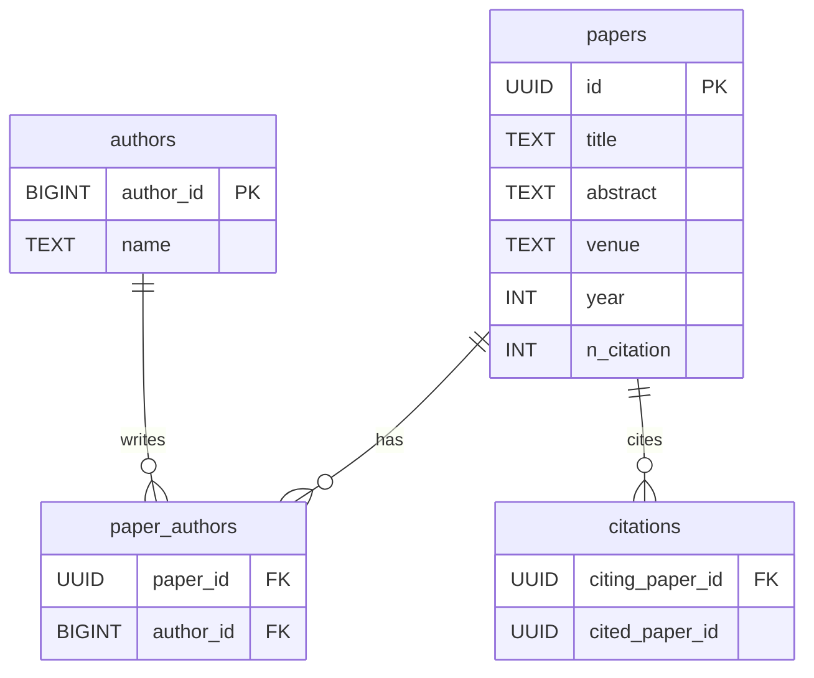
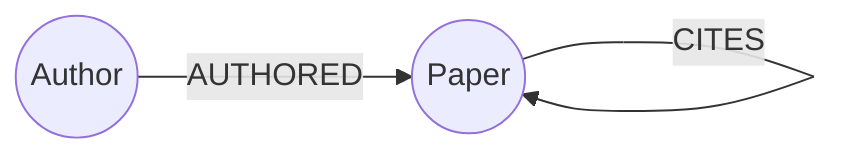
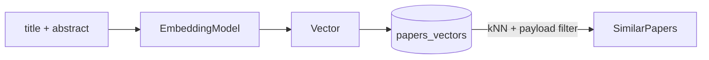

## Database schema overview (for slides/report)

### Postgres (relational)

```mermaid
erDiagram
  papers {
    UUID id PK
    TEXT title
    TEXT abstract
    TEXT venue
    INT year
    INT n_citation
  }

  authors {
    BIGINT author_id PK
    TEXT name
  }

  paper_authors {
    UUID paper_id FK
    BIGINT author_id FK
  }

  citations {
    UUID citing_paper_id FK
    UUID cited_paper_id
  }

  papers ||--o{ paper_authors : has
  authors ||--o{ paper_authors : writes
  papers ||--o{ citations : cites
```

### Neo4j (graph)

```mermaid
flowchart LR
  Author((Author)) -->|AUTHORED| Paper((Paper))
  Paper -->|CITES| Paper
```

### Qdrant (vector)

```mermaid
flowchart LR
  PaperText["title + abstract"] --> Embed[EmbeddingModel]
  Embed --> Vec[Vector]
  Vec --> Qdrant[(papers_vectors)]
  Qdrant -->|"kNN + payload filter"| Results[SimilarPapers]
```

