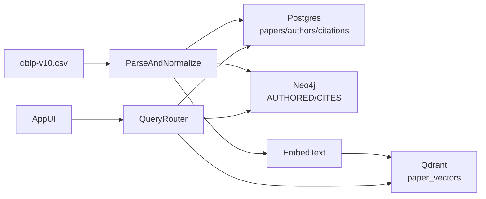

## Goals and success criteria

- **Answer the competency questions** from `[/Users/js/Downloads/DSC202_Project_V2/resources/Topic_Details.md](/Users/js/Downloads/DSC202_Project_V2/resources/Topic_Details.md)` using the *right* store for each query.
- **Justify every store** per `[/Users/js/Downloads/DSC202_Project_V2/resources/Project_Guidelines.md](/Users/js/Downloads/DSC202_Project_V2/resources/Project_Guidelines.md)` (Postgres/Neo4j/Qdrant are each necessary, not decorative).
- Provide **schema diagrams** (ERD for Postgres, property graph diagram for Neo4j, collection schema for Qdrant).
- Deliver: **repo code**, **written report**, **slides**, and a **scripted live demo** (15 min + 5 min Q&A).

## Inputs (source of truth)

- CSV: `/Users/js/Downloads/DSC202_Project_V2/data/raw/dblp-v10.csv`
- Parsed columns (observed from first rows): `id`, `title`, `abstract`, `venue`, `year`, `n_citation`, `authors` (string-list), `references` (string-list).

## Data model (three derived datasets)

### Postgres (relational: filters, aggregations, reporting)

- **Tables** (minimum viable):
  - `papers(id PK, title, abstract, venue, year, n_citation)`
  - `authors(author_id PK, name UNIQUE)`
  - `paper_authors(paper_id FK, author_id FK, PRIMARY KEY(paper_id, author_id))`
  - `citations(citing_paper_id FK, cited_paper_id, PRIMARY KEY(citing_paper_id, cited_paper_id))`
  - Optional normalization: `venues(venue_id PK, name UNIQUE)` + `papers.venue_id`
  - Optional for “domains/fields”: `fields(field_id PK, name)` + `paper_fields(paper_id, field_id)` (can be derived from venue mapping or keyword/topic clustering later).
- **Why needed (store justification)**:
  - Fast **structured filters** (year/venue/field), **group-by analytics** (top venues, citation distributions), and stable **source-of-truth** entities for joining results returned by Neo4j/Qdrant.

### Neo4j (graph: multi-hop, connectivity, communities)

- **Nodes**: `(:Paper {id, title, year, venue})`, `(:Author {name})` (or `{author_id}` aligned with Postgres).
- **Relationships**:
  - `(:Author)-[:AUTHORED]->(:Paper)`
  - `(:Paper)-[:CITES]->(:Paper)`
  - Optional: `(:Paper)-[:IN_FIELD]->(:Field)` if you materialize fields.
- **Why needed (store justification)**:
  - **Indirect citations** (path queries), **collaboration networks**, **community detection**, and **bridge authors** require graph traversal and graph algorithms that are awkward/expensive in pure SQL.

### Qdrant (vector: semantic similarity)

- **Collection**: `papers_vectors`
  - **Point id**: paper `id`
  - **Vector**: embedding of `title + "\n" + abstract` (skip/flag empty abstracts)
  - **Payload**: `title`, `year`, `venue`, optionally `authors` (or author ids)
- **Why needed (store justification)**:
  - Competency questions about “**most semantically similar**” and “**cross-field relevance based on content**” require vector similarity search (nearest neighbors), which neither SQL nor property graphs provide natively.

## End-to-end ingestion / dataset generation

- **Parsing**: robust CSV reader + safe parsing of `authors`/`references` string-lists (e.g. literal-eval style parsing, with validation).
- **Derive three outputs** from the same parsed stream:
  - Postgres bulk loads (staging CSVs or direct `COPY`) for `papers`, `authors`, `paper_authors`, `citations`.
  - Neo4j loads (either `LOAD CSV`-style import files or driver-based batched upserts).
  - Qdrant batch embedding + upsert.
- **Consistency**:
  - Use the CSV’s `id` as the canonical paper identifier across all stores.
  - Decide a canonical author key (either normalized name string or generated `author_id`) and keep it consistent across Postgres/Neo4j payloads.

## Query layer: mapping competency questions to stores

Implement a small “query router” that calls the right backend per question type, then merges results:

- **Qdrant**: semantic similarity (kNN), “emerging trends by similarity” (restrict by year payload).
- **Neo4j**: collaboration frequency, indirect citations, clusters, bridge authors, topic connectivity via graph.
- **Postgres**: time/venue/field filters, aggregates, citation stats, final result enrichment (titles/venues/years).

## Minimal application (demo-ready)

- **UI**: a simple web UI (or notebook + CLI if allowed, but web is better for a 15-min demo) with:
  - Semantic search box (Qdrant) returning top-k papers.
  - “Explain relationships” panel for a selected paper/author (Neo4j paths, coauthors, indirect citations).
  - Filter + analytics panel (Postgres aggregates; e.g., top collaborators, citations vs similarity summaries).
- **Demo script**: 3 short flows that each clearly justify one store, plus one combined flow.

## Schema visualizations (required)

- Postgres ERD (tables + keys).
- Neo4j property graph diagram (nodes/edges).
- Qdrant collection schema (vector dim + payload fields) + short note on embedding model choice.

## Report + slides outline

- **Problem & use case** (why paper KG + semantic search).
- **Data understanding** (CSV fields, parsing challenges).
- **Store-by-store justification** tied directly to competency questions.
- **Schemas + design decisions**.
- **Ingestion pipeline** and reproducibility.
- **Query demos** with screenshots.
- **Limitations and next steps** (e.g., field labeling quality, embedding model constraints).

## Test plan (project-level)

- Ingestion sanity checks: counts of papers/authors/edges; sample spot checks.
- Query validation: for each competency question, show at least one working example + expected behavior.

## Risks and mitigations

- **Scale/time**: start with a subset (e.g. first N rows) for development; scale up once pipeline is stable.
- **Missing abstracts**: skip or fallback to title-only embeddings.
- **Author name ambiguity**: accept name-based identity for MVP; document limitations.

